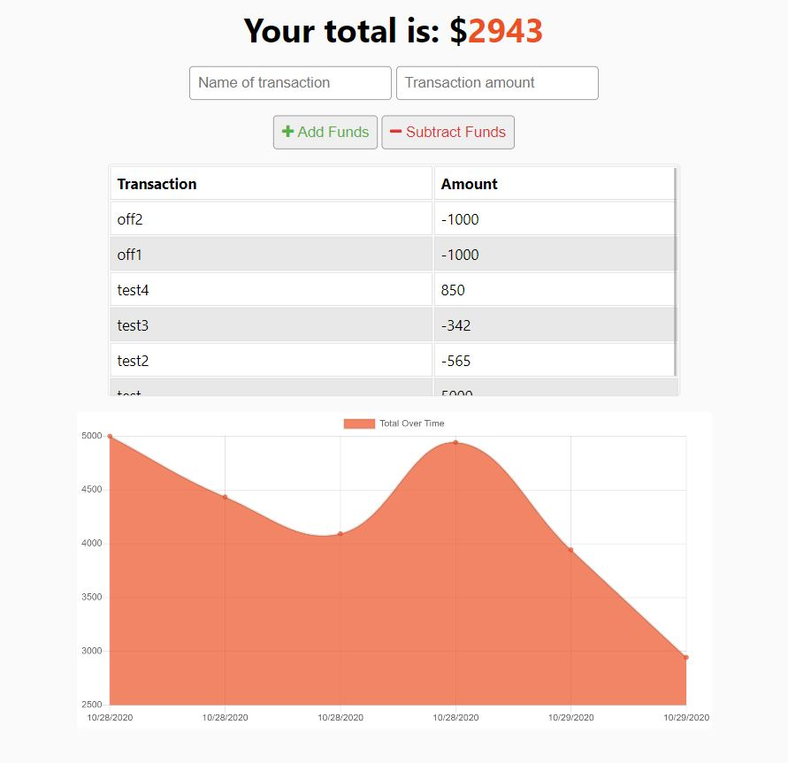

# Offline Budget App 
   [](https://github.com/wilsoncollin7?tab=followers) [](https://opensource.org/licenses/MIT)

  This app allows the user to track their expenses even if there is no connection. The app will still function and store data if there is no internet, once a connection is made the data will automatically be sent to the database. :rocket:

  Here is the deployed app on Heroku: [Budget App](https://expenses-tracker-offline.herokuapp.com/)

  <p align="center">
    
  </p>
  
  ## Table of Contents

  - [Installation](#installation)
  - [Usage](#usage)
  - [License](#license)
  - [Contributing](#contributing)
  - [Tests](#tests)
  - [Questions](#questions)

  ## Installation

  You can clone the repo and launch the app on your own localhost, and set up your own heroku so the app is always available. You will need to initialize Mongolab for heroku to work.

  ```
  $ heroku addons:create mongolab -a {YOUR APP NAME}
  ```

  ## Usage

  This project uses an Node.js Express server and a service-worker to cache the files in the app. The database is Mongoose DB. Run:

  ```
  npm install
  npm start
  ```

  ## License

  This aplication is made with the [MIT License](https://opensource.org/licenses/MIT)

  ## Contributing

  To contribute please contact me!

  ## Tests

  If you find any bugs or issues please contact me!

  ## Questions

  For any questions you might have, you can email me at wilsoncollin7@gmail.com. You can also check out my [GitHub Profile](https://github.com/wilsoncollin7).

  

